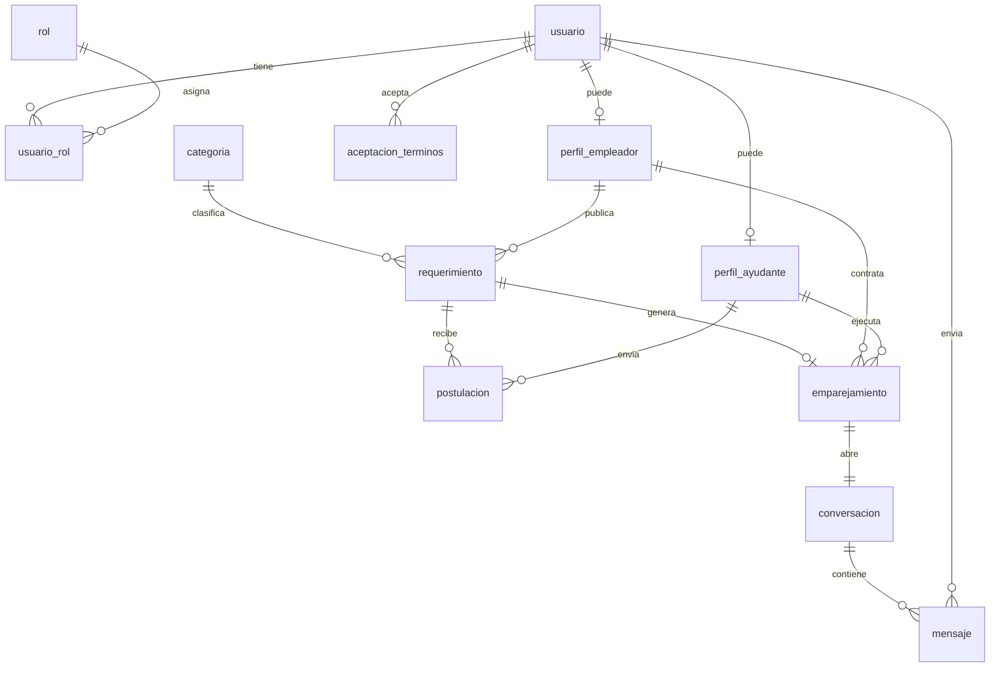

# EZWorks — Diseño de base de datos (MySQL)

**Versión:** 1.0 (Sprint 1 / MVP backend)  
**Stack:** Java 17, Spring Boot, Spring Security (JWT), MySQL 8, Angular (cliente)  
**Referencia:** ERS EZWorks, diagrama de clases inicial, módulo de seguridad reemplazado por Spring Security

---

## 1. Resumen ejecutivo

El diagrama de clases original mezcla **capa de aplicación** (servicios, DTOs, encriptador, gestor de tokens) con **modelo de dominio persistible**. Con Spring Security + JWT, la seguridad **no se modela como tablas de negocio** salvo credenciales, roles y trazabilidad legal.

Este documento define el esquema MySQL para el **MVP**: identidad, vacantes, postulaciones, match, chat básico y administración mínima. Pagos con pasarela, deuda acumulada, notificaciones push, geolocalización avanzada y reseñas con evidencias quedan **diseñados pero aplazados** (sección 8).

---

## 2. Cambios respecto al diagrama de clases

### 2.1 Módulo «Seguridad» → Spring Security (sin tablas propias)

| Elemento del diagrama | Decisión MVP |
|----------------------|--------------|
| `ServicioAutenticacion` | `AuthController` + `AuthenticationManager` + `UserDetailsService` |
| `LoginRequestDTO` / `RegistroRequestDTO` / `AuthResponseDTO` | DTOs REST (no persistidos) |
| `EncriptadorPassword` | `BCryptPasswordEncoder` (Spring Security) |
| `GestorTokens` | JWT firmado (`jjwt` o `spring-security-oauth2-resource-server`) |
| Token en `AuthResponseDTO` | Access token (15–60 min) + opcional refresh token en tabla `refresh_token` |

**Persistencia de autenticación:**

- Contraseña solo como `password_hash` (nunca texto plano).
- Roles como filas en `rol` + relación `usuario_rol` (autoridades `ROLE_EMPLEADOR`, `ROLE_AYUDANTE`, `ROLE_ADMIN`).
- Estado de cuenta: `activo`, `suspendido`, `baneado`, `inhabilitado_deuda` (este último se usa cuando exista el módulo de deuda).

### 2.2 `Persona` → `usuario`

Un solo agregado de identidad. Los nombres del ERS (**Empleador**, **Ayudante**, **Administrador**) son **roles**, no subclases con tablas distintas de login.

| Diagrama | Tabla / columna |
|----------|-----------------|
| `uID` | `usuario.id` BIGINT PK auto_increment |
| `email` | `usuario.email` UNIQUE |
| `contraseña` | `usuario.password_hash` VARCHAR(255) |
| `telefono` | `usuario.telefono` |
| Aceptación legal (ERS §3.6) | `aceptacion_terminos` (fecha + IP) |

**Perfiles extendidos (1:1 opcional):**

- `perfil_empleador` — datos solo de quien publica vacantes.
- `perfil_ayudante` — bio, calificación promedio cacheada, etc.
- Un usuario puede tener **ambos perfiles** si se registró con los dos roles (RF-01).

Los métodos `postular()` y `publicarEmpleo()` del diagrama son **casos de uso / servicios**, no columnas.

### 2.3 `Postulacion` (diagrama) vs terminología ERS

En el diagrama, la clase con `asunto`, `descripcion`, `precioPago` es en realidad un **requerimiento/vacante** publicado por el empleador.

| Concepto ERS | Tabla |
|--------------|-------|
| Micro-trabajo / vacante / requerimiento | `requerimiento` |
| Postulación del ayudante | `postulacion` (FK a `requerimiento` + `perfil_ayudante`) |
| Match | `emparejamiento` |

### 2.4 `Estado` (herencia) → enumeración

`EstadoPendiente`, `EstadoEmparejado`, `EstadoFinalizado` se reemplazan por:

- Columna `requerimiento.estado` ENUM: `BORRADOR`, `PUBLICADO`, `EN_MATCH`, `FINALIZADO`, `CANCELADO`.
- Columna `postulacion.estado` ENUM: `PENDIENTE`, `ACEPTADA`, `RECHAZADA`, `RETIRADA`.

### 2.5 Pagos y deuda (fase 2)

Se reserva el esquema (sección 7) pero **no se implementa en el primer script Flyway/Liquibase del MVP** salvo tablas vacías o comentadas, según preferencia del equipo.

### 2.6 Mensajería

`Conversacion` se crea **al confirmar el match** (RF-06), ligada 1:1 a `emparejamiento`.

---

## 3. Alcance MVP vs fases posteriores

### 3.1 Incluido en MVP (tablas + APIs)

| RF | Descripción | Tablas principales |
|----|-------------|-------------------|
| RF-01 | Registro con rol Empleador y/o Ayudante | `usuario`, `rol`, `usuario_rol`, perfiles, `aceptacion_terminos` |
| RF-02 | Edición de perfil | `usuario`, `perfil_*` |
| RF-03 | Publicar/editar requerimiento | `requerimiento`, `categoria` |
| RF-04 | Ver vacantes y postular | `requerimiento`, `postulacion` |
| RF-05 | Selección / match | `emparejamiento`, actualización estados |
| RF-06 | Chat tras match | `conversacion`, `mensaje` |
| RF-20 (parcial) | Admin: categorías | `categoria` + rol `ADMIN` |
| Legal | Aceptación T&C | `aceptacion_terminos` |

Autenticación/login: cubierto por Spring Security (no es un RF numerado pero es transversal).

### 3.2 Diferido (esquema preparado, implementación después)

| RF | Motivo de aplazamiento |
|----|------------------------|
| RF-07, RF-08, RF-09 | Notificaciones (push/email) — infra adicional |
| RF-10 | Portafolio con archivos — almacenamiento S3/local |
| RF-11, RF-12 | Reseñas con evidencias — flujo post-finalización |
| RF-13 a RF-19 | Pasarela, deuda, inhabilitación por deuda — integración externa + reglas de negocio |
| Geolocalización exacta | API mapas + revelar coords solo tras match (RF restricción privacidad) |
| RF-20 completo | Suspender/banear — UI admin + auditoría (tabla `accion_admin` en fase 2) |

---

## 4. Modelo entidad-relación (MVP)



---

## 5. Diccionario de tablas (MVP)

### 5.1 Seguridad e identidad

#### `rol`

| Columna | Tipo | Notas |
|---------|------|-------|
| id | TINYINT PK | |
| codigo | VARCHAR(30) UNIQUE | `EMPLEADOR`, `AYUDANTE`, `ADMIN` |
| nombre | VARCHAR(80) | Etiqueta UI |

Datos semilla: tres roles del ERS.

#### `usuario`

| Columna | Tipo | Notas |
|---------|------|-------|
| id | BIGINT PK AI | |
| email | VARCHAR(255) UNIQUE NOT NULL | Login |
| password_hash | VARCHAR(255) NOT NULL | BCrypt |
| nombre | VARCHAR(100) NOT NULL | |
| apellido | VARCHAR(100) NOT NULL | |
| telefono | VARCHAR(20) | |
| estado_cuenta | ENUM | `ACTIVO`, `SUSPENDIDO`, `BANEADO`, `INHABILITADO_DEUDA` |
| creado_en | DATETIME(3) | |
| actualizado_en | DATETIME(3) | |

Índices: `email`, `estado_cuenta`.

**Spring Security:** entidad `Usuario` implementa `UserDetails`; roles vía `usuario_rol` → `GrantedAuthority`.

#### `usuario_rol`

| Columna | Tipo | Notas |
|---------|------|-------|
| usuario_id | BIGINT FK → usuario | |
| rol_id | TINYINT FK → rol | |
| asignado_en | DATETIME(3) | |

PK compuesta `(usuario_id, rol_id)`.

#### `perfil_empleador`

| Columna | Tipo | Notas |
|---------|------|-------|
| id | BIGINT PK AI | |
| usuario_id | BIGINT FK UNIQUE → usuario | |
| calificacion_promedio | DECIMAL(3,2) DEFAULT 0 | Cache; actualizar al haber reseñas |
| total_resenas | INT DEFAULT 0 | |

#### `perfil_ayudante`

| Columna | Tipo | Notas |
|---------|------|-------|
| id | BIGINT PK AI | |
| usuario_id | BIGINT FK UNIQUE → usuario | |
| bio | TEXT | |
| calificacion_promedio | DECIMAL(3,2) DEFAULT 0 | |
| total_resenas | INT DEFAULT 0 | |

#### `aceptacion_terminos`

| Columna | Tipo | Notas |
|---------|------|-------|
| id | BIGINT PK AI | |
| usuario_id | BIGINT FK | |
| version_terminos | VARCHAR(20) NOT NULL | ej. `2026-05-22` |
| ip_origen | VARCHAR(45) | IPv4/IPv6 |
| aceptado_en | DATETIME(3) NOT NULL | |

#### `refresh_token` (opcional, recomendado)

| Columna | Tipo | Notas |
|---------|------|-------|
| id | BIGINT PK AI | |
| usuario_id | BIGINT FK | |
| token_hash | VARCHAR(64) UNIQUE | Hash del refresh, no el token en claro |
| expira_en | DATETIME(3) | |
| revocado | BOOLEAN DEFAULT FALSE | |

---

### 5.2 Catálogo y vacantes

#### `categoria`

| Columna | Tipo | Notas |
|---------|------|-------|
| id | SMALLINT PK AI | |
| nombre | VARCHAR(80) UNIQUE NOT NULL | RF-20 admin |
| activa | BOOLEAN DEFAULT TRUE | |
| creado_en | DATETIME(3) | |

#### `requerimiento` (vacante / micro-trabajo)

| Columna | Tipo | Notas |
|---------|------|-------|
| id | BIGINT PK AI | |
| empleador_id | BIGINT FK → perfil_empleador | |
| categoria_id | SMALLINT FK → categoria | |
| titulo | VARCHAR(150) NOT NULL | Antes «asunto» |
| descripcion | TEXT NOT NULL | |
| remuneracion | DECIMAL(12,2) NOT NULL | Antes «precioPago» |
| estado | ENUM NOT NULL | Ver §2.4 |
| zona_aproximada | VARCHAR(200) | Texto/barrio para MVP sin API mapas |
| latitud_aprox | DECIMAL(10,7) NULL | Opcional MVP |
| longitud_aprox | DECIMAL(10,7) NULL | Opcional MVP |
| latitud_exacta | DECIMAL(10,7) NULL | Rellenar solo tras match (Ley 1581) |
| longitud_exacta | DECIMAL(10,7) NULL | |
| direccion_exacta | VARCHAR(300) NULL | |
| publicado_en | DATETIME(3) | |
| actualizado_en | DATETIME(3) | |
| finalizado_en | DATETIME(3) NULL | |

**Reglas:**

- Edición (RF-03) solo si `estado IN ('BORRADOR','PUBLICADO')` y sin `emparejamiento` activo.
- Un empleador solo puede tener **un match activo por requerimiento** (UNIQUE en `emparejamiento.requerimiento_id`).

Índices: `(estado, categoria_id)`, `(empleador_id)`, `(publicado_en DESC)`.

---

### 5.3 Postulación y match

#### `postulacion`

| Columna | Tipo | Notas |
|---------|------|-------|
| id | BIGINT PK AI | |
| requerimiento_id | BIGINT FK | |
| ayudante_id | BIGINT FK → perfil_ayudante | |
| mensaje_presentacion | VARCHAR(500) NULL | |
| estado | ENUM | `PENDIENTE`, `ACEPTADA`, `RECHAZADA`, `RETIRADA` |
| creado_en | DATETIME(3) | |

UNIQUE `(requerimiento_id, ayudante_id)` — un ayudante no postula dos veces la misma vacante.

#### `emparejamiento` (match)

| Columna | Tipo | Notas |
|---------|------|-------|
| id | BIGINT PK AI | |
| requerimiento_id | BIGINT FK UNIQUE | Un match por vacante |
| empleador_id | BIGINT FK → perfil_empleador | Redundante controlado por app |
| ayudante_id | BIGINT FK → perfil_ayudante | |
| postulacion_id | BIGINT FK UNIQUE → postulacion | Postulación ganadora |
| establecido_en | DATETIME(3) | |
| finalizado_en | DATETIME(3) NULL | |

Al insertar match: `postulacion.estado = ACEPTADA`, demás postulaciones del mismo requerimiento → `RECHAZADA`, `requerimiento.estado = EN_MATCH`.

**Hook fase 2:** disparar filas en `deuda` para empleador y ayudante (RF-16).

---

### 5.4 Mensajería

#### `conversacion`

| Columna | Tipo | Notas |
|---------|------|-------|
| id | BIGINT PK AI | |
| emparejamiento_id | BIGINT FK UNIQUE | 1 conversación por match |
| abierta_en | DATETIME(3) | |

#### `mensaje`

| Columna | Tipo | Notas |
|---------|------|-------|
| id | BIGINT PK AI | |
| conversacion_id | BIGINT FK | |
| emisor_usuario_id | BIGINT FK → usuario | |
| contenido | TEXT NOT NULL | |
| leido | BOOLEAN DEFAULT FALSE | |
| enviado_en | DATETIME(3) | |

Índice: `(conversacion_id, enviado_en)`.

El campo `estado` del diagrama original se simplifica a `leido` en MVP; estados de entrega (enviado/entregado) son fase 2.

---

## 6. Mapeo Spring Security ↔ BD

```
┌─────────────────┐     loadUserByUsername(email)      ┌──────────────┐
│  AuthController │ ─────────────────────────────────►│   usuario    │
└────────┬────────┘                                     └──────┬───────┘
         │ JWT (claims: sub, roles, userId)                    │
         ▼                                                     ▼
┌─────────────────┐                              ┌──────────────────────┐
│ JwtAuthFilter   │                              │ usuario_rol + rol    │
└─────────────────┘                              └──────────────────────┘
```

**Claims JWT sugeridos:**

- `sub`: email
- `uid`: usuario.id
- `roles`: `["ROLE_EMPLEADOR","ROLE_AYUDANTE"]`
- `estado`: `ACTIVO` (rechazar token si no activo)

**Autorización por endpoint (ejemplos):**

| Recurso | Rol mínimo |
|---------|------------|
| POST `/api/requerimientos` | `ROLE_EMPLEADOR` |
| POST `/api/requerimientos/{id}/postulaciones` | `ROLE_AYUDANTE` |
| POST `/api/requerimientos/{id}/match` | `ROLE_EMPLEADOR` (dueño) |
| GET `/api/admin/categorias` | `ROLE_ADMIN` |

No se guarda el JWT en base de datos (stateless). Solo refresh token si se adopta rotación.

---

## 7. Esquema reservado — Fase 2 (pagos, deuda, reseñas)

Diseño alineado al diagrama y ERS; **no obligatorio en el primer migration del MVP**.

### 7.1 Reseñas (RF-11, RF-12)

#### `resena`

| Columna | Tipo | Notas |
|---------|------|-------|
| id | BIGINT PK AI | |
| emparejamiento_id | BIGINT FK | |
| autor_usuario_id | BIGINT FK | |
| calificado_usuario_id | BIGINT FK | |
| rol_autor | ENUM | `EMPLEADOR`, `AYUDANTE` |
| puntuacion | TINYINT | 1–5 |
| comentario | TEXT | |
| creado_en | DATETIME(3) | |

UNIQUE `(emparejamiento_id, autor_usuario_id)` — una reseña por parte.

#### `evidencia_trabajo` (RF-10, RF-11)

| Columna | Tipo | Notas |
|---------|------|-------|
| id | BIGINT PK AI | |
| resena_id | BIGINT FK NULL | |
| perfil_ayudante_id | BIGINT FK NULL | Portafolio |
| url_archivo | VARCHAR(500) | |
| tipo | ENUM | `FOTO`, `DOCUMENTO` |
| subido_en | DATETIME(3) | |

### 7.2 Pagos y deuda (RF-13 a RF-19)

#### `metodo_pago`

| Columna | Tipo | Notas |
|---------|------|-------|
| id | BIGINT PK AI | |
| usuario_id | BIGINT FK | |
| proveedor | VARCHAR(40) | MercadoPago, ePayco, etc. |
| referencia_externa | VARCHAR(120) | Tokenizado en pasarela |
| ultimos_cuatro | CHAR(4) | |
| activo | BOOLEAN | |

#### `transaccion`

| Columna | Tipo | Notas |
|---------|------|-------|
| id | BIGINT PK AI | |
| emparejamiento_id | BIGINT FK NULL | Pago entre usuarios |
| tipo | ENUM | `PAGO_TRABAJO`, `COMISION_PLATAFORMA`, `SALDO_DEUDA` |
| monto | DECIMAL(12,2) | |
| metodo_pago_id | BIGINT FK NULL | |
| estado | ENUM | `PENDIENTE`, `COMPLETADA`, `FALLIDA` |
| id_pasarela_externa | VARCHAR(120) | |
| creado_en | DATETIME(3) | |

#### `deuda_plataforma`

| Columna | Tipo | Notas |
|---------|------|-------|
| id | BIGINT PK AI | |
| usuario_id | BIGINT FK | |
| emparejamiento_id | BIGINT FK | Origen del cargo |
| monto | DECIMAL(12,2) | Comisión EZWorks |
| saldo_pendiente | DECIMAL(12,2) | |
| estado | ENUM | `PENDIENTE`, `PARCIAL`, `PAGADA` |
| generada_en | DATETIME(3) | |

#### `configuracion_plataforma`

| Clave | Valor | Uso |
|-------|-------|-----|
| `limite_deuda_maxima` | DECIMAL | RF-19 |
| `comision_por_match` | DECIMAL | RF-16 |

Vista materializada o columna `usuario.saldo_deuda_acumulado` actualizada por trigger/job para inhabilitación rápida.

### 7.3 Administración disciplinaria (RF-20)

#### `accion_admin`

| Columna | Tipo | Notas |
|---------|------|-------|
| id | BIGINT PK AI | |
| admin_usuario_id | BIGINT FK | |
| usuario_afectado_id | BIGINT FK | |
| tipo | ENUM | `ADVERTENCIA`, `SUSPENSION`, `BAN`, `HABILITAR` |
| motivo | TEXT | |
| creado_en | DATETIME(3) | |

### 7.4 Notificaciones (RF-07–09)

#### `notificacion`

| Columna | Tipo | Notas |
|---------|------|-------|
| id | BIGINT PK AI | |
| usuario_id | BIGINT FK | |
| tipo | ENUM | `NUEVA_POSTULACION`, `MATCH`, `MENSAJE` |
| referencia_id | BIGINT | ID polimórfico lógico |
| leida | BOOLEAN | |
| creado_en | DATETIME(3) | |

---

## 8. Script SQL inicial (MVP)

```sql
-- EZWorks MVP schema
CREATE DATABASE IF NOT EXISTS ezworks
  CHARACTER SET utf8mb4
  COLLATE utf8mb4_unicode_ci;

USE ezworks;

CREATE TABLE rol (
  id TINYINT UNSIGNED PRIMARY KEY AUTO_INCREMENT,
  codigo VARCHAR(30) NOT NULL UNIQUE,
  nombre VARCHAR(80) NOT NULL
);

INSERT INTO rol (codigo, nombre) VALUES
  ('EMPLEADOR', 'Empleador'),
  ('AYUDANTE', 'Ayudante'),
  ('ADMIN', 'Administrador');

CREATE TABLE usuario (
  id BIGINT UNSIGNED PRIMARY KEY AUTO_INCREMENT,
  email VARCHAR(255) NOT NULL UNIQUE,
  password_hash VARCHAR(255) NOT NULL,
  nombre VARCHAR(100) NOT NULL,
  apellido VARCHAR(100) NOT NULL,
  telefono VARCHAR(20),
  estado_cuenta ENUM('ACTIVO','SUSPENDIDO','BANEADO','INHABILITADO_DEUDA')
    NOT NULL DEFAULT 'ACTIVO',
  creado_en DATETIME(3) NOT NULL DEFAULT CURRENT_TIMESTAMP(3),
  actualizado_en DATETIME(3) NOT NULL DEFAULT CURRENT_TIMESTAMP(3)
    ON UPDATE CURRENT_TIMESTAMP(3)
);

CREATE TABLE usuario_rol (
  usuario_id BIGINT UNSIGNED NOT NULL,
  rol_id TINYINT UNSIGNED NOT NULL,
  asignado_en DATETIME(3) NOT NULL DEFAULT CURRENT_TIMESTAMP(3),
  PRIMARY KEY (usuario_id, rol_id),
  FOREIGN KEY (usuario_id) REFERENCES usuario(id),
  FOREIGN KEY (rol_id) REFERENCES rol(id)
);

CREATE TABLE perfil_empleador (
  id BIGINT UNSIGNED PRIMARY KEY AUTO_INCREMENT,
  usuario_id BIGINT UNSIGNED NOT NULL UNIQUE,
  calificacion_promedio DECIMAL(3,2) NOT NULL DEFAULT 0.00,
  total_resenas INT UNSIGNED NOT NULL DEFAULT 0,
  FOREIGN KEY (usuario_id) REFERENCES usuario(id)
);

CREATE TABLE perfil_ayudante (
  id BIGINT UNSIGNED PRIMARY KEY AUTO_INCREMENT,
  usuario_id BIGINT UNSIGNED NOT NULL UNIQUE,
  bio TEXT,
  calificacion_promedio DECIMAL(3,2) NOT NULL DEFAULT 0.00,
  total_resenas INT UNSIGNED NOT NULL DEFAULT 0,
  FOREIGN KEY (usuario_id) REFERENCES usuario(id)
);

CREATE TABLE aceptacion_terminos (
  id BIGINT UNSIGNED PRIMARY KEY AUTO_INCREMENT,
  usuario_id BIGINT UNSIGNED NOT NULL,
  version_terminos VARCHAR(20) NOT NULL,
  ip_origen VARCHAR(45),
  aceptado_en DATETIME(3) NOT NULL DEFAULT CURRENT_TIMESTAMP(3),
  FOREIGN KEY (usuario_id) REFERENCES usuario(id)
);

CREATE TABLE refresh_token (
  id BIGINT UNSIGNED PRIMARY KEY AUTO_INCREMENT,
  usuario_id BIGINT UNSIGNED NOT NULL,
  token_hash VARCHAR(64) NOT NULL UNIQUE,
  expira_en DATETIME(3) NOT NULL,
  revocado BOOLEAN NOT NULL DEFAULT FALSE,
  FOREIGN KEY (usuario_id) REFERENCES usuario(id)
);

CREATE TABLE categoria (
  id SMALLINT UNSIGNED PRIMARY KEY AUTO_INCREMENT,
  nombre VARCHAR(80) NOT NULL UNIQUE,
  activa BOOLEAN NOT NULL DEFAULT TRUE,
  creado_en DATETIME(3) NOT NULL DEFAULT CURRENT_TIMESTAMP(3)
);

CREATE TABLE requerimiento (
  id BIGINT UNSIGNED PRIMARY KEY AUTO_INCREMENT,
  empleador_id BIGINT UNSIGNED NOT NULL,
  categoria_id SMALLINT UNSIGNED NOT NULL,
  titulo VARCHAR(150) NOT NULL,
  descripcion TEXT NOT NULL,
  remuneracion DECIMAL(12,2) NOT NULL,
  estado ENUM('BORRADOR','PUBLICADO','EN_MATCH','FINALIZADO','CANCELADO')
    NOT NULL DEFAULT 'BORRADOR',
  zona_aproximada VARCHAR(200),
  latitud_aprox DECIMAL(10,7),
  longitud_aprox DECIMAL(10,7),
  latitud_exacta DECIMAL(10,7),
  longitud_exacta DECIMAL(10,7),
  direccion_exacta VARCHAR(300),
  publicado_en DATETIME(3),
  actualizado_en DATETIME(3) NOT NULL DEFAULT CURRENT_TIMESTAMP(3)
    ON UPDATE CURRENT_TIMESTAMP(3),
  finalizado_en DATETIME(3),
  FOREIGN KEY (empleador_id) REFERENCES perfil_empleador(id),
  FOREIGN KEY (categoria_id) REFERENCES categoria(id),
  INDEX idx_req_estado_cat (estado, categoria_id),
  INDEX idx_req_empleador (empleador_id)
);

CREATE TABLE postulacion (
  id BIGINT UNSIGNED PRIMARY KEY AUTO_INCREMENT,
  requerimiento_id BIGINT UNSIGNED NOT NULL,
  ayudante_id BIGINT UNSIGNED NOT NULL,
  mensaje_presentacion VARCHAR(500),
  estado ENUM('PENDIENTE','ACEPTADA','RECHAZADA','RETIRADA')
    NOT NULL DEFAULT 'PENDIENTE',
  creado_en DATETIME(3) NOT NULL DEFAULT CURRENT_TIMESTAMP(3),
  UNIQUE KEY uk_postulacion (requerimiento_id, ayudante_id),
  FOREIGN KEY (requerimiento_id) REFERENCES requerimiento(id),
  FOREIGN KEY (ayudante_id) REFERENCES perfil_ayudante(id)
);

CREATE TABLE emparejamiento (
  id BIGINT UNSIGNED PRIMARY KEY AUTO_INCREMENT,
  requerimiento_id BIGINT UNSIGNED NOT NULL UNIQUE,
  empleador_id BIGINT UNSIGNED NOT NULL,
  ayudante_id BIGINT UNSIGNED NOT NULL,
  postulacion_id BIGINT UNSIGNED NOT NULL UNIQUE,
  establecido_en DATETIME(3) NOT NULL DEFAULT CURRENT_TIMESTAMP(3),
  finalizado_en DATETIME(3),
  FOREIGN KEY (requerimiento_id) REFERENCES requerimiento(id),
  FOREIGN KEY (empleador_id) REFERENCES perfil_empleador(id),
  FOREIGN KEY (ayudante_id) REFERENCES perfil_ayudante(id),
  FOREIGN KEY (postulacion_id) REFERENCES postulacion(id)
);

CREATE TABLE conversacion (
  id BIGINT UNSIGNED PRIMARY KEY AUTO_INCREMENT,
  emparejamiento_id BIGINT UNSIGNED NOT NULL UNIQUE,
  abierta_en DATETIME(3) NOT NULL DEFAULT CURRENT_TIMESTAMP(3),
  FOREIGN KEY (emparejamiento_id) REFERENCES emparejamiento(id)
);

CREATE TABLE mensaje (
  id BIGINT UNSIGNED PRIMARY KEY AUTO_INCREMENT,
  conversacion_id BIGINT UNSIGNED NOT NULL,
  emisor_usuario_id BIGINT UNSIGNED NOT NULL,
  contenido TEXT NOT NULL,
  leido BOOLEAN NOT NULL DEFAULT FALSE,
  enviado_en DATETIME(3) NOT NULL DEFAULT CURRENT_TIMESTAMP(3),
  FOREIGN KEY (conversacion_id) REFERENCES conversacion(id),
  FOREIGN KEY (emisor_usuario_id) REFERENCES usuario(id),
  INDEX idx_mensaje_conv (conversacion_id, enviado_en)
);
```

---

## 9. Convenciones JPA / Spring Boot

| Tabla | Entidad Java sugerida | Paquete |
|-------|----------------------|---------|
| usuario | `Usuario` implements `UserDetails` | `domain.user` |
| rol | `Rol` | `domain.user` |
| requerimiento | `Requerimiento` | `domain.job` |
| postulacion | `Postulacion` | `domain.job` |
| emparejamiento | `Emparejamiento` | `domain.job` |
| mensaje | `Mensaje` | `domain.messaging` |

- IDs: `Long` en Java, `BIGINT UNSIGNED` en MySQL.
- Fechas: `Instant` o `LocalDateTime` con zona `America/Bogota`.
- Migraciones: Flyway `V1__mvp_schema.sql` usando el script de §8.

---

## 10. Checklist de validación con el ERS

| Requisito | Cubierto en MVP | Notas |
|-----------|-----------------|-------|
| RF-01 | Sí | Registro + roles + perfiles |
| RF-02 | Sí | CRUD usuario/perfiles |
| RF-03 | Sí | `requerimiento` + estados |
| RF-04 | Sí | Listado + `postulacion` |
| RF-05 | Sí | `emparejamiento` |
| RF-06 | Sí | `conversacion` + `mensaje` |
| RF-07–09 | No (tabla preparada §7.4) | |
| RF-10–12 | No (tablas §7.1) | |
| RF-13–19 | No (tablas §7.2) | |
| RF-20 | Parcial | Solo `categoria` + rol ADMIN |
| Privacidad ubicación | Parcial | Columnas exactas NULL hasta match |
| Login encriptado | Sí | Spring Security BCrypt |
| T&C + IP | Sí | `aceptacion_terminos` |

---

## 11. Próximos pasos recomendados

1. Crear proyecto Spring Boot 3.x con dependencias: `spring-boot-starter-security`, `spring-boot-starter-data-jpa`, `mysql-connector-j`, `flyway-core`, `jjwt` (o OAuth2 Resource Server).
2. Aplicar `V1__mvp_schema.sql` en MySQL local.
3. Implementar `UserDetailsService`, `SecurityFilterChain`, registro (RF-01) y flujo requerimiento → postulación → match → chat.
4. En Sprint 2: migrations `V2__pagos_deuda.sql` y `V3__resenas_notificaciones.sql` según prioridad del equipo.

---

*Documento generado para el repositorio `ezworks-backend`. Cualquier cambio de negocio en el ERS debe actualizar primero este diseño y luego las migraciones Flyway.*
